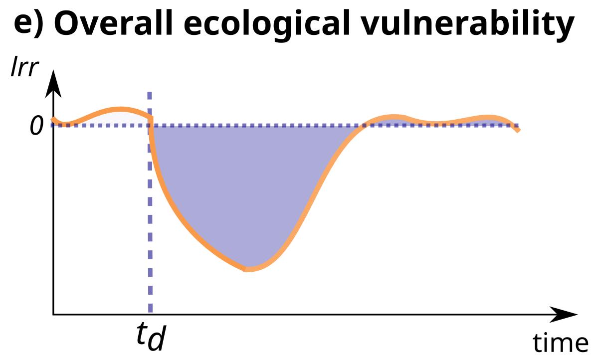

```{r, echo=FALSE}
knitr::opts_chunk$set(collapse = TRUE, comment = "#>")
options(rmarkdown.html_vignette.check_title = FALSE)
set.seed(123)
```

```{r, setup, include=FALSE}
library(estar)
library(tidyr)
library(dplyr)
library(ggplot2)
library(cowplot)
library(viridis)
library(forcats)
library(kableExtra)
library(vegan)
source("custom_aesthetics.R")

label_intensity <- function(intensity, mu) {
  paste0("Conc = ", intensity, " micro g/L")
}
```

# Overview of the data

We illustrate the use of `estar` functions on a dataset from an
ecotoxicological study about the effects of the chlorpyrifos insecticide
on a community of aquatic macroinvertebrates [@van_den_brink_effects_1996; @wijngaarden_effects_1996]. The insecticide negatively affects freshwater
macroinvertebrates, and, to a lesser degree, zooplankton species. This insecticide was applied at four
different concentrations (0.1, 0.9, 6, and 44 microg/ L), with two
replicates per concentration level. Additionally, four replicates were
used as control, undisturbed systems ('baseline' in `estar`
terminology). In response to a pulse disturbance, @van_den_brink_effects_1996 reports decreased and
destabilized community diversity, but no effects on gross primary
production nor respiration. The community is composed of 128 species,
classified into 5 functional groups: herbivores, detriti-herbivores,
carnivores, omnivores, and detritivores.

```{r echo = FALSE, message = FALSE,  fig.height = 6, fig.width = 8, fig.cap = "Figure 1. Organism mean count (log axis) of the five functional groups over the course of ecotoxicological experiment. The vertical dashed line identifies the time when the insecticide was applied (at week 0), and facets represent the different concentrations (micro g/L)."}
(
  aquacomm_resps.logplot <- aquacomm_fgps |>
    tidyr::pivot_longer(
      cols = c(herb, detr_herb, carn, omni, detr),
      names_to = "gp",
      values_to = "abund"
    ) |>
    ## summarize to plot
    dplyr::group_by(time, treat, gp) |>
    dplyr::summarize(abund_logmean = log(mean(abund))) |>
    dplyr::ungroup() |>
    dplyr::mutate(
      gp = forcats::fct_recode(
        factor(gp),
        Herbivore = "herb",
        Detr_Herbivore = "detr_herb",
        Carnivore = "carn",
        Omnivore = "omni",
        Detritivore = "detr"
      )
    ) |>
    ggplot(aes(
      x = time,
      y = abund_logmean,
      group = gp,
      colour = gp
    )) +
    geom_line() +
    geom_point(size = 1) +
    geom_vline(
      aes(xintercept = 0),
      linetype = 2,
      colour = "black"
    ) +
    scale_colour_manual(values = gp_colours_full) +
    facet_wrap(
      ~ treat,
      nrow = 5,
      labeller = labeller(treat = label_intensity)
    ) +
    labs(x = "Time (week)", y = "Mean abundance (log)", colour = "Functional\ngroup") +
    estar:::theme_estar()
)
```

```{r echo=FALSE, message = FALSE, fig.height = 6, fig.width = 8, fig.cap="Figure 2. Organism count (mean +- sd in grey) of the five functional groups over the course of ecotoxicological experiment. The vertical dashed line identifies the time when the insecticide was applied (at week 0), and facets represent the different concentrations (micro g/L)."}
(
  aquacomm_resps.rawplot <- aquacomm_fgps |>
    tidyr::pivot_longer(
      cols = c(herb, detr_herb, carn, omni, detr),
      names_to = "gp",
      values_to = "abund"
    ) |>
    ## summarize to plot
    dplyr::group_by(time, treat, gp) |>
    dplyr::summarize(abund.mean = mean(abund), abund.sd = sd(abund)) |>
    dplyr::ungroup() |>
    dplyr::mutate(
      gp = forcats::fct_recode(
        factor(gp),
        Herbivore = "herb",
        Detr_Herbivore = "detr_herb",
        Carnivore = "carn",
        Omnivore = "omni",
        Detritivore = "detr"
      )
    ) |>
    ggplot(aes(
      x = time,
      y = abund.mean,
      group = gp,
      colour = gp
    )) +
    geom_ribbon(
      aes(ymin = abund.mean - abund.sd, ymax = abund.mean + abund.sd),
      col = "gainsboro",
      fill = "gainsboro"
    ) +
    geom_line() +
    geom_point(size = 1) +
    geom_vline(
      aes(xintercept = 0),
      linetype = 2,
      colour = "black"
    ) +
    scale_colour_manual(values = gp_colours_full) +
    facet_wrap(
      ~ treat,
      nrow = 5,
      labeller = labeller(treat = label_intensity)
    ) +
    labs(x = "Time (week)", y = "Mean abundance", colour = "Functional\ngroup") +
    estar:::theme_estar()
)
```

# Main functions

Examples of each function applied to the example dataset. For the
functions that require a user-defined time step when the system has
recovered, we use week 28, when all groups seem to have stabilized their
growth curve based on visual inspection (Fig.1).

## Functional stability

### Invariability

Invariability calculated as the inverse of standard deviation of
residuals of the linear model that predicts the log response ratio of
the state variable in the disturbed and baseline systems by time. The
baseline system in our example dataset is reflected by control ditches,
to which no pesticide was applied. The time frame is defined by `td_i`
and specified in the data frame `d_data` (`aquacomm_resps`, Fig. 3-a).

```{r}
invariability(
  type = "functional",
  mode = "lm_res",
  response = "lrr",
  metric_tf = c(1, max(aquacomm_resps$time)),
  vd_i = "statvar_db",
  td_i = "time",
  d_data = aquacomm_resps,
  vb_i = "statvar_bl",
  tb_i = "time",
  b_data = aquacomm_resps
)
```

Invariability calculated as the inverse of standard deviation of
residuals of the linear model fitted to predict the state variable in
the disturbed system by time (Fig. 3-b).

```{r}
invariability(
  type = "functional",
  mode = "lm_res",
  metric_tf = c(1, max(aquacomm_resps$time)),
  response = "v",
  vd_i = "statvar_db",
  td_i = "time",
  d_data = aquacomm_resps,
  vb_i = "statvar_bl",
  tb_i = "time",
  b_data = aquacomm_resps
)
```

Invariability calculated as the inverse of the coefficient of variation
of the log response ratio of the state variable in the disturbed and
baseline systems (Fig. 3-c).

```{r}
invariability(
  type = "functional",
  response = "lrr",
  mode = "cv",
  metric_tf = c(1, max(aquacomm_resps$time)),
  vd_i = "statvar_db",
  td_i = "time",
  b_data = aquacomm_resps,
  vb_i = "statvar_bl",
  tb_i = "time",
  d_data = aquacomm_resps
)
```

Invariability calculated as the inverse of the coefficient of variation
of a state variable in the disturbed system (Fig. 3-d).

```{r}
invariability(
  type = "functional",
  response = "v",
  mode = "cv",
  metric_tf = c(1, max(aquacomm_resps$time)),
  vd_i = "statvar_db",
  td_i = "time",
  d_data = aquacomm_resps,
  vb_i = "statvar_bl",
  tb_i = "time",
  b_data = aquacomm_resps
)
```

```{r invar_schem, echo=FALSE, fig.height = 4, fig.cap="Figure 3. Schematic representation of how functional invariability is calculated by `estar`: $v$ and $lrr$ refer to the state variable in the disturbed system and the log response ratio of the state variables in the disturbed compared to the baseline time-series, respectively, $t_d$ is the time of disturbance. a) and b) illustrate the calculation of invariability as the coefficient of variation of the log response ratio and the state variable in the disturbed system, respectively; c and d) illustrate invariability calculated as the standard deviation of the residuals of the fitted linear model (grey solid line) of the log response ratio and the state variable in the disturbed system, respectively, as functions of time.", out.width = '500px'}
knitr::include_graphics("figures/invariability.png")
```

### Resistance

Resistance calculated in relation to an independent baseline time series (`b = "input"`), as the log response ratio (`res_mode = "lrr"`) of the state variable in the disturbed and baseline systems at the first time step following disturbance (`res_time = "defined"`, `res_t = 1`, Fig. 4-a).

```{r}
resistance(
  type = "functional",
  b = "input",
  res_mode = "lrr",
  res_time = "defined",
  res_t = 1,
  vd_i = "statvar_db",
  td_i = "time",
  d_data = aquacomm_resps,
  vb_i = "statvar_bl",
  tb_i = "time",
  b_data = aquacomm_resps
)
```

Resistance calculated in relation to a baseline time series (`b = "input"`), as the highest (`res_time = "max"`) log response ratio (`res_mode = "lrr"`) of the state variable in the disturbed and baseline (independent) systems during a given time frame (`res_tf = c(0.14, 28)`, Fig. 4-b).

```{r}
resistance(
  type = "functional",
  b = "input",
  res_mode = "lrr",
  res_time = "max",
  res_tf = c(0.14, 28),
  vd_i = "statvar_db",
  td_i = "time",
  d_data = aquacomm_resps,
  vb_i = "statvar_bl",
  tb_i = "time",
  b_data = aquacomm_resps
)
```

Resistance calculated in relation to a baseline time series (`b = "input"`), as the difference (`res_mode = "diff"`) at the first time step following disturbance (`res_time = "defined"`, `res_t = 1`, Fig. 4-c).

```{r}
resistance(
  type = "functional",
  b = "input",
  res_mode = "diff",
  res_time = "defined",
  res_t = 1,
  vd_i = "statvar_db",
  td_i = "time",
  d_data = aquacomm_resps,
  vb_i = "statvar_bl",
  tb_i = "time",
  b_data = aquacomm_resps
)
```

Resistance calculated in relation to a baseline time series (`b = "input"`), as the highest (`res_time = "max"`) absolute difference (`res_mode = "diff"`) during a given time frame, from the first day after disturbance had happened until week 28, when recovery is assumed to have happened (`res_tf = c(0.14, 28)`, Fig. 4-d).

```{r}
resistance(
  type = "functional",
  b = "input",
  res_mode = "diff",
  res_time = "max",
  res_tf = c(0.14, 28),
  vd_i = "statvar_db",
  td_i = "time",
  d_data = aquacomm_resps,
  vb_i = "statvar_bl",
  tb_i = "time",
  b_data = aquacomm_resps
)
```

Resistance calculated in relation to a pre-disturbance baseline (`b = "d"`), composed of the state variable values in the three time steps before disturbance (`b_tf = c(-4, -0.14)`), as the highest (`res_time = "max"`) absolute difference (`res_mode = "diff"`) during a given time frame (`res_tf = c(0.14, 28)`).

```{r}
resistance(
  type = "functional",
  b = "d",
  b_tf = c(-4, 0.14),
  res_time = "max",
  res_mode = "diff",
  res_tf =c(0.14, 28),
  vd_i = "statvar_bl",
  td_i = "time",
  d_data = aquacomm_resps
)
```

Resistance calculated in relation to a pre-disturbance baseline (`b = "d"`), composed of the state variable values in the three time steps before disturbance (`b_tf = c(-4, -0.14)`), as the highest (`res_time = "defined"`) absolute log-ratio (`res_mode = "lrr"`) at a precise time step (`res_t = 1)`).

```{r}
resistance(
  type = "functional",
  b = "d",
  b_tf = c(-4, 0.14),
  res_mode = "lrr",
  res_time = "defined",
  res_t = 1,
  vd_i = "statvar_db",
  td_i = "time",
  d_data = aquacomm_resps
)
```

```{r resistance_schem, fig.height = 4, echo=FALSE, fig.cap="Figure 4. Schematic representation of how functional rate of recovery is calculated by `estar`: $lrr$ and $diff$ refer, respectively, to the log response ratio and to the difference between the state variable in the disturbed system in relation to the baseline value(s), $v$ to 'state variable', $t_{res}$, is the user-defined time step when resistance is calculated, and $t_{high}$, to the time step of the highest response in relation to the baseline. The four possibilities of calculating resistance (a-d) resistance result from calculating resistance from $lrr$ and $diff$ at time steps $t_{res}$ and $t_{high}$.", out.width = '500px'}
knitr::include_graphics("figures/resistance.png")
```

### Extent of recovery

Extent of recovery calculated as the log response ratio (`response = "lrr"`) of the state variable in the disturbed and baseline independent systems (`b = "input"`), at a user-defined time step when recovery is assumed to have happened (`t_rec = 28`, Fig. 5-a).

```{r}
recovery_extent(
  type = "functional",
  response = "lrr",
  b = "input",
  t_rec = 28,
  vd_i = "statvar_db",
  td_i = "time",
  d_data = aquacomm_resps,
  vb_i = "statvar_bl",
  tb_i = "time",
  b_data = aquacomm_resps
) 
```

Extent of recovery calculated as the log response ratio (`response = "lrr"`) of the state variable in the disturbed time-series in relation to the state variable pre-disturbance (`b = "d"`), summarized by the mean value (`summ_mode = "mean"` - default, over a period `b_tf = c(-4, 0)`). The extent of recovery is calculated at the point we understand all groups have stabilized (`t_rec = 28`, Fig. 5-a).

```{r}
recovery_extent(
  type = "functional",
  response = "lrr",
  b = "d",
  summ_mode = "mean",
  b_tf = c(-4, 0),
  t_rec = 28,
  vd_i = "statvar_db",
  td_i = "time",
  d_data = aquacomm_resps
)
```

Extent of recovery calculated as the difference (`response = "diff"`) between the state variables in a disturbed time-series and the baseline (`b = "input"`), at the predefined time step (`t_rec = 28`, Fig. 5-b).

```{r}
recovery_extent(
  type = "functional",
  response = "diff",
  b = "input",
  t_rec = 28,
  vd_i = "statvar_db",
  td_i = "time",
  d_data = aquacomm_resps,
  vb_i = "statvar_bl",
  tb_i = "time",
  b_data = aquacomm_resps
)
```

```{r echo=FALSE, fig.height = 4, fig.cap="Figure 5. Schematic representation of how functional extent of recovery is calculated by `estar`. $t_{post}$ is the user-defined timestep when recovery is supposed to have happened. a) $lrr$ is the log response ratio of the state variable in the disturbed system compared to the baseline time-series and b) $diff$ is the difference between them.", out.width = '500px'}
knitr::include_graphics("figures/extent_recovery.png")
```

### Rate of recovery

Rate of recovery calculated as the slope of the linear model which predicts the log response ratio of the state variable in the disturbed system compared to the baseline (`b = "input"`) by time (since one day after disturbance until recovery, `metric_tf = c(0.14, 28)`, Fig. 6-a).

```{r}
recovery_rate(
  type = "functional",
  response = "lrr",
  b = "input",
  metric_tf = c(0.14, 28),
  vd_i = "statvar_db",
  td_i = "time",
  d_data = aquacomm_resps,
  vb_i = "statvar_bl",
  tb_i = "time",
  b_data = aquacomm_resps
)
```

Rate of recovery calculated as the slope of the linear model which predicts the values of the state variable in the disturbed system(`response = "v"`) by time (over a time frame (`metric_tf = c(0.14, 28)`, Fig. 6-b).

```{r}
recovery_rate(
  type = "functional",
  response = "v",
  b = "input",
  metric_tf = c(0.14, 28),
  vd_i = "statvar_db",
  td_i = "time",
  d_data = aquacomm_resps,
  vb_i = "statvar_bl",
  tb_i = "time",
  b_data = aquacomm_resps
)
```

```{r echo=FALSE, fig.height = 4, fig.cap="Figure 6. Schematic representation of how functional rate of recovery is calculated by `estar`: a) $lrr$ is the log response ratio of the state variable in the disturbed system compared to the baseline time-series, b) $v$ is the state variable. The blue solid line identifies the linear model fitted to predict the response from time (along with its equation) and the double-headed arrow identifies the slope, which is the measure of rate of recovery", out.width = '500px'}
knitr::include_graphics("figures/rate_recovery.png")
```

### Persistence

Proportion of time over which the state variable stays within 1 standard deviation from the mean of the state variable values from an independent baseline (`b = "input"`) over the period specified by the user, often since application of the disturbance and until the end of the experiment (`metric_tf = c(0.14, 56)`, Fig. 7).

```{r}
persistence(
  type = "functional",
  b = "input",
  metric_tf = c(0.14, 56),
  vd_i = "statvar_db",
  td_i = "time",
  d_data = aquacomm_resps,
  vb_i = "statvar_bl",
  tb_i = "time",
  b_data = aquacomm_resps
)
```

Proportion of time over which the state variable stays within 1 standard deviation from the mean of the state variable values during a pre-disturbance (`b = "d"`) time period (`b_tf = c(-4, 0.14)`). Persistence is measuredover the period specified by the user, often since application of the disturbance and until the end of the experiment (`metric_tf = c(0.14, 56)`, Fig. 7).

```{r}
persistence(
  type = "functional",
  b = "d",
  b_tf = c(-4, 0.14),
  metric_tf = c(0.14, 56),
  vd_i = "statvar_db",
  td_i = "time",
  d_data = aquacomm_resps
)
```

```{r echo=FALSE, out.width = '300px', fig.cap="Figure 7. Schematic representation of how functional persistence is calculated by `estar`: $v_b \\pm sd_b$ is the  standard deviation limit around the mean ($v_b$) of the baseline state variable. $t_a$ is the period for which persistence is calculated for, and $t_P$, the period during which the state variable remained inside the limits."}

knitr::include_graphics("figures/persistence.png")
```

### Overall Ecological Vulnerability

Area under the curve of the log response ratio (`response = "lrr"`) between the state variable in the disturbed and baseline scenarios, since shortly after the disturbance - 1 day after (we don't have data from t = 0, the moment of application of the insecticide) until the the end of the observation period (`metric_tf = c(0.14, 56)`).

```{r}
oev(
  type = "functional",
  response = "lrr",
  metric_tf = c(0.14, 56),
  vd_i = "statvar_db",
  td_i = "time",
  d_data = aquacomm_resps,
  vb_i = "statvar_bl",
  tb_i = "time",
  b_data = aquacomm_resps
)
```

```{r echo=FALSE, out.width = '300px', fig.cap="Figure 8. Schematic representation of the calculation of overall ecological etability in `estar`: $lrr$ is the log response ratio of the state variable in the disturbed system compared to the baseline time-series, $t_d$ is the time step when disturbance happened. The purple shaded area is the area under the curve calculated by the metric."}


```

## Compositional stability

The functions for functional stability can be used to calculate the stability of community composition from community compositional data. To do so, the functions call the `vegdist` function (from the `vegan` package), to which we can pass on the required `method` and `binary` arguments. Here, we use the default settings for arguments `method` and `binary`, which means the Bray-Curtis dissimilarity is used.

```{r}
# Reformatting the macroinvertebrate community long-format data into 
# community composition data
comm_data <- aquacomm_fgps |>
    dplyr::group_by(time, treat) |>
    dplyr::filter(treat %in% c(0, 44)) |>
    dplyr::summarize_at(vars(herb, detr_herb, carn, omni, detr),
                        mean) |>
    dplyr::ungroup()

control_comm <- comm_data |>
        dplyr::filter(treat == 0) |>
        dplyr::select(-treat)
dist_comm <- comm_data |>
        dplyr::filter(treat == 44) |>
        dplyr::select(-treat)
```

It is worth noting that, if the user wants to calculate compositional stability from other metrics (possibly not available through `vegdist`), they can input it as a single variable time-series, as demonstrated in the section "Functional stability".

### Invariability

Invariability calculated for the the whole time-series (since disturbance, `metric_tf = c(0.14, 56)`).

```{r eval=FALSE}
invariability(
  type = "compositional",
  metric_tf = c(0.14, 56),
  comm_d = dist_comm,
  comm_b = control_comm,
  comm_t = "time")
```

### Resistance

Resistance can be calculated in two ways:

- As the maximal resistance (`res_time = "max"`) over a time period defined by the user. In this case, from the first day to the 28th week after disturbance, when recovery is assumed to have happened (`res_tf = c(0.14, 28)`).

```{r}
resistance(type = "compositional",
          res_tf = c(0.14, 28),
          res_time = "max",
          comm_d = dist_comm,
          comm_b = control_comm,
          comm_t = "time")
```

- At a time step chosen by the user (`res_time = "defined"`). In this case, when recovery is assumed to have happened (week 28, `res_t = 28`), but often at the first time step after disturbance.

```{r eval=FALSE}
resistance(type = "compositional",
          res_time = "defined",
          res_t = 28,
          comm_d = dist_comm,
          comm_b = control_comm,
          comm_t = "time")
```

### Rate of recovery

Rate of recovery of the community between the first day after disturbance and recovery at week 28 (`metric_tf = c(0.14, 28)`).

```{r}
recovery_rate(type = "compositional",
              metric_tf = c(0.14, 28),
              comm_d = dist_comm,
              comm_b = control_comm,
              comm_t = "time")
```
 
### Extent of recovery

Since we assume recovery happened by week 28, we calculate its extent by that time (`t_rec = 28`).

```{r}
recovery_extent(type = "compositional",
          t_rec = 28,
          comm_d = dist_comm,
          comm_b = control_comm,
          comm_t = "time")
```

### Persistence

Here, the community is considered to be persistent if it's dissimilarity with the undisturbed, baseline community stays between 0.5 and 0.9 (`low_lim = 0.5, high_lim = 0.9`). We here check if the community stayed in this persistence "zone" after recovery (week 28) until the end of the experiment (week 56, `metric_tf = c(28, 56)`).

```{r}
persistence(type = "compositional",
            b = "input",
            metric_tf = c(28, 56),
            comm_d = dist_comm,
            comm_b = control_comm,
            comm_t = "time",
            low_lim = 0.5,
            high_lim = 0.9)
```

### Overall Ecological Vulnerability

```{r}
oev(type = "compositional",
    metric_tf = c(0.14, 56),
    comm_d = dist_comm,
    comm_b = control_comm,
    comm_t = "time")
```

# Performance

We conducted the benchmark analysis of the execution time of the different forms of calculating the functional stability metrics. The number attached to the function name in "Function calls" identifies the order in which the function call appears in the vignette. The code used for the analysis is available in `performance_analysis.R`.

While the time to run the calls can differ significantly from each other, the execution time did not exceed 0.01 seconds for our example.

```{r echo=FALSE}
load("functional_performance.rda")
```

## Invariability

```{r}
df_list$inv_benchmark %>%
  dplyr::select(-neval) %>% 
  kableExtra::kbl() %>%
  kable_styling(bootstrap_options = c("striped", "hover", "condensed", "responsive"))
```

{width=100%}

## Resistance

```{r}
df_list$resis_benchmark %>%
  dplyr::select(-neval) %>% 
  kableExtra::kbl() %>%
  kable_styling(bootstrap_options = c("striped", "hover", "condensed", "responsive"))
```

{width=100%}

## Recovery rate

```{r}
df_list$rate_benchmark %>%
  dplyr::select(-neval) %>% 
  kableExtra::kbl() %>%
  kable_styling(bootstrap_options = c("striped", "hover", "condensed", "responsive"))
```

{width=100%}

## Recovery extent

```{r}
df_list$extent %>%
  dplyr::select(-neval) %>% 
  kableExtra::kbl() %>%
  kable_styling(bootstrap_options = c("striped", "hover", "condensed", "responsive"))
```

{width=100%}

## Persistence

```{r}
df_list$persist_benchmark %>%
  dplyr::select(-neval) %>% 
  kableExtra::kbl() %>%
  kable_styling(bootstrap_options = c("striped", "hover", "condensed", "responsive"))
```

{width=100%}

## Overall Ecological Vulnerability

```{r}
df_list$oev_benchmark %>%
  dplyr::select(-neval) %>% 
  kableExtra::kbl() %>%
  kable_styling(bootstrap_options = c("striped", "hover", "condensed", "responsive"))
```

{width=100%}

------------------------------------------------------------------------

# References
