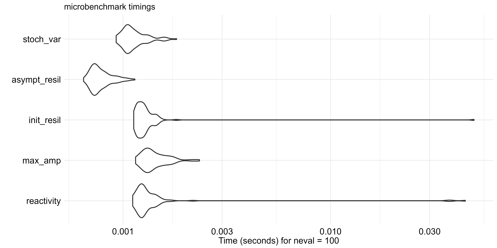

```{r knit-setup, include=FALSE, message=FALSE}
knitr::opts_chunk$set(
  comment = "#>",
  warning=FALSE
  )
options(rmarkdown.html_vignette.check_title = FALSE) ## title and VignetteIndexEntry are slightly different and this avoids a warning message every time it's rendered
```

```{r message=FALSE}
library(estar)
library(tidyr)
library(dplyr)
library(tibble)
library(ggplot2)
library(purrr)
library(viridis)
library(MARSS)
library(hesim)
library(kableExtra)
source("custom_aesthetics.R")

label_intensity <- function(intensity, mu){
  paste0("Conc = ", intensity, " micro g/L")
}
```

Calculation of the Jacobian stability properties (in the context of the `estar` package, Fig. 1) relies on the interaction strengths between species composing a community.

![Figure 1: Jacobian stability properties calculated by `estar`: reactivity ($R_a$), calculated at the first time step following disturbance ($t_{d+1}$); maximal amplification ($A_{max}$); initial resilience ($R_0$); asymptotic resilience (R∞); and intrinsic stochastic invariability ($I_S$). For simplicity, the properties are illustrated as being calculated in relation to a state variable ($v$) disturbed at time $t_d$, but the properties are calculated from the community’s species interactions matrix and not a single state variable.](figures/jacobian_metrics.png){width=400px}

This information is classically summarized in the *community matrix* [sensu @novak_characterizing_2016, detailed in the Glossary in the main text].
In community models, this is equivalent to a time-discrete version [@downing_temporal_2020] of the Jacobian matrix composed of the partial derivatives of the dynamical equations describing each species population growth [@dominguez-garcia_unveiling_2019]. The Jacobian matrix consists of $m \times m$ entries (for $m$ species). Each entry reflects the effect of the population abundance of the species in the column on the population growth rate of the species in the row. (Fig. 2)

{width=40%}

In real-world communities, interaction strengths can be estimated with multivariate autoregressive state-space (MARSS) models. To assist `estar` users, in this vignette, we focus on explaining [how a MARSS model works](#intro-marss-model) and how these models are used with the functions provided by the [`estar` package](#marss-in-estar).
To facilitate understanding, we illustrate the definition of a MARSS model in the context of this application to an aquatic community.
For a more general and formal definition, refer to the [`MARSS` package documentation](https://nwfsc-timeseries.github.io/MARSS/).

# Overview of demonstration data

Similar to what we did for the functional properties, we illustrate the use of Jacobian properties on a dataset compiled from an ecotoxicological study about the effects of insecticide on a community of aquatic macroinvertebrates [@van_den_brink_effects_1996; @wijngaarden_effects_1996].
The insecticide chlorpyrifos negatively affects freshwater macroinvertebrates, and, to a lesser degree, zooplankton species.
This insecticide was applied at four different concentrations (0.1, 0.9, 6, and 44 $\mu$g/ L), with two replicates per concentration level.
Additionally, four replicates were used as control, i.e. an undisturbed systems ('baseline' in `estar` terminology).
The community is composed of 128 species, classified into 5 functional groups: herbivores, detritiherbivores, carnivores, omnivores, and detritivores (Fig. 3).

```{r echo = FALSE, message = FALSE,  fig.height = 6, fig.width = 8, fig.cap = " Figure 3: Organism mean count (log axis) of the five functional groups over the course of ecotoxicological experiment. The vertical dashed line identifies the time when chloryfiros insecticide was applied (at week 0), and facets represent the different concentrations (micro g/L)."}
(data_logplot <- aquacomm_fgps |>
  tidyr::pivot_longer(cols = c(herb, detr_herb, carn, omni, detr),
                      names_to = "gp", values_to = "abund") |>
  ## summarize to plot
  dplyr::group_by(time, treat, gp) |>
  dplyr::summarize(abund_logmean = log(mean(abund))) |>
  dplyr::ungroup() |>
  dplyr::mutate(gp = forcats::fct_recode(factor(gp), 
                      Herbivore = "herb",
                      Detr_Herbivore = "detr_herb",
                      Carnivore = "carn",
                      Omnivore = "omni",
                      Detritivore = "detr")) |>
  ggplot(aes(x = time, y = abund_logmean, group = gp, colour = gp)) +
  geom_line() +
  geom_point(size = 1) +
  geom_vline(aes(xintercept = 0), linetype = 2, colour = "black") +
  scale_colour_manual(values = gp_colours_full) +
  facet_wrap(~treat, nrow = 5, labeller = labeller(treat = label_intensity)) +
  labs(x = "Time (week)", y = "Mean abundance (log)", 
       colour = "Functional\ngroup") +
  estar:::theme_estar())
```

# MARSS models

## Introduction to MARSS models {#intro-marss-model}

A complete MARSS model that describes a state process ($\mathbf{X}$) assessed via an observation process ($\mathbf{Y}$) is defined as: \begin{equation}
\begin{gathered}
\mathbf{x}_t = \mathbf{B}\mathbf{x}_{t-1}+\mathbf{u}+\mathbf{C}\mathbf{c}_{t}+\mathbf{w}_t \text{ where } \mathbf{w}_t \sim \ \text{MVN}(0,\mathbf{Q}) \\
\mathbf{y}_t = \mathbf{Z}\mathbf{x}_t+\mathbf{a}+\mathbf{D}\mathbf{d}_{t}+\mathbf{v}_t \text{ where } \mathbf{v}_t \sim \ \text{MVN}(0,\mathbf{R}) \\
\mathbf{x}_1 \sim\ \text{MVN}(\pi,\Lambda) \text{ or } \mathbf{x}_0 \sim\ \text{MVN}(\pi,\Lambda)
\end{gathered}
\end{equation}

where

-   $\mathbf{X}$ is a $m \times T$ matrix, composed of the unknown abundance values of $m$ species or functional groups ($fg$, rows), over time $T$ ($t$, columns)

```{=tex}
\begin{equation}
X=
\begin{bmatrix}
    x_{fg1, t1} & x_{fg1, t2} & ... & x_{fg1, tT}\\
    x_{fg2, t1} & x_{fg2, t2} & ... & x_{fg2, tT}\\
      ... & ... & ... & ...\\
      x_{fgm, t1} & x_{fgm, t2} & ... & x_{fgm, tT}
\end{bmatrix}
\end{equation}
```
-   $\mathbf{Y}$ is a $n \times T$ matrix, composed of $n$ observations (rows) over time $T$ ($t$, columns)

```{=tex}
\begin{equation}
Y=
\begin{bmatrix}
    y_{1, t1} & y_{1, t2} & ... & y_{1, tT}\\
    y_{2, t1} & y_{2, t2} & ... & y_{2, tT}\\
    ... & ... & ... & ...\\
    y_{n, t1} & y_{n, t2} & ... & y_{n, tT}
\end{bmatrix}
\end{equation}
```

- $\pi$ is either a parameter or a fixed prior. It is a $m \times 1$ matrix.

Note that:

-   considering that the observations in $\mathbf{Y}$ refer to processes $\mathbf{X}$, $n \geq m$. Missing values can be passed as `NA`.
-   from $\mathbf{X}$ and $\mathbf{Y}$ alone, it is impossible to trace how observations refer to processes. We will address this in the description of $\mathbf{Y}$.

The state process ($\mathbf{X}$) is described by:

-   $\mathbf{x}_t$ is a $m \times 1$ vector of unknown abundances of the $m$ species at time $t$.
-   $\mathbf{B}$ is a $m \times m$ matrix of states covariances. This is the matrix of **interactions strengths** ($\beta$) we want to estimate to calculate 
Jacobian properties. The estimated $\beta_{(i,j)}$ reflect the effect of the abundances of species in the column (species j) on the growth rate of the species in the row (species i).
-   $\mathbf{u}$ is a $m \times 1$ vector of states fixed values. For example, expected abundance values for each functional group.
-   $\mathbf{C}$ is a $m \times p$ matrix of coefficients ($\gamma$) of each of the $p$ covariates (enviromental conditions) effects on each of the $m$ states (abundances).
-   $\mathbf{c}_t$ is a $p \times 1$ vector of covariate values. For example, environmental conditions which are expected to affect abundances.
-   $\mathbf{w}_t$ is a $m \times 1$ vector of the state ($X$) process errors. These account for the environmental stochasticity of the system.

Thus, in matrix formulation:

```{=tex}
\begin{equation}
\begin{bmatrix}
    x_{1}\\
    ... \\
    x_{m}
    \end{bmatrix}_t = 
\begin{bmatrix}
    \beta_{\mathrm{1,1}} & ... & \beta_{\mathrm{1,m}} \\
    ... & ... & ... \\
    \beta_{\mathrm{m,1}} & ... & \beta_{\mathrm{m,m}}
\end{bmatrix}
\begin{bmatrix}
    x_{1}\\
    ... \\
    x_{m}
\end{bmatrix}_{t-1} 
+
\begin{bmatrix}
    u_{1}\\
    ...\\
    u_{m}
\end{bmatrix} 
+ 
\begin{bmatrix}
    \gamma_{\mathrm{1,1}} & ... & \gamma_{\mathrm{1,p}} \\
    ... & ... & ... \\
    \gamma_{\mathrm{m,1}} & ... & \gamma_{\mathrm{m,p}}
\end{bmatrix}
\begin{bmatrix}
    c_{\mathrm{1}} \\
    ... \\
    c_{\mathrm{m}}
\end{bmatrix}_{t}
+
\begin{bmatrix}
w_{1}\\
...\\
w_{m}
\end{bmatrix}_t \\
\end{equation}
```

The $w_{t}$ errors follow a multivariate normal distribution of mean 0, and covariance $\mathbf{Q}$ (a $m \times m$ matrix).
\begin{equation}
\mathbf{w}_t \sim \,\text{MVN}
\begin{pmatrix}
0,
    \begin{bmatrix}
        \sigma_{\mathrm{1}} & ... & \sigma_{\mathrm{1,m}} \\
        ... & ... & ... \\
        \sigma_{\mathrm{m,1}} & ... & \sigma_{\mathrm{m}} \\ 
        \end{bmatrix}
\end{pmatrix}\\
\end{equation}

where ($\sigma$) refer to variances of abundances (diagonal) and covariances among abundances of different species (off-diagonal).

The model initial conditions can be specified at $t=0$ ($x_0$) or $t=1$ ($x_1$).

```{=tex}
\begin{equation}
\begin{bmatrix}
    x_{fg1}\\
    ...\\
    x_{fgm}
\end{bmatrix}_0 
= 
\begin{bmatrix}
    \mu_1\\
    ...\\
    \mu_m
\end{bmatrix}_t
\end{equation}
```

The observation process ($\mathbf{Y}$) is described by:

-   $\mathbf{y}_t$ is a $m \times 1$ vector with the number of $n$ observations taken at time $t$.
-   $\mathbf{Z}$ is a $n \times m$ matrix which describes the relationships ($\zeta$) between hidden states $\mathbf{x}$ (real abundances of functional groups) and the observations $\mathbf{y}$ (samples).
-   $\mathbf{a}$ is a $n \times 1$ vector of fixed values. It reflects biases that offset observations from process values.
-   $\mathbf{D}$ is a $n \times q$ matrix of $\delta$ coefficients of each of the $q$ covariates on each of the $n$ observations
-   $\delta$ is either a parameter or a fixed prior. It is a $m \times m$ variance-covariance matrix.
-   $\mathbf{d}_t$ s a $q \times 1$ vector of covariate values affecting the observation process.
-   $\mathbf{v}_t$ is a $n \times 1$ vector of observation errors. They follow a multivariate normal distribution with mean 0, and covariance $\mathbf{R}$ (a $n \times n$ matrix) .

In matrix formulation: 

```{=tex}
\begin{equation}
\begin{bmatrix}
    y_{1}\\
    ... \\
    y_{n}
    \end{bmatrix}_t = 
\begin{bmatrix}
    \zeta_{\mathrm{1,1}} & ... & \zeta_{\mathrm{1,m}} \\
    ... & ... & ... \\
    \zeta_{\mathrm{m,1}} & ... & \zeta_{\mathrm{m,m}}
\end{bmatrix}
\begin{bmatrix}
    x_{1}\\
    ... \\
    x_{m}
\end{bmatrix}_{t-1} 
+
\begin{bmatrix}
    a_{obs1}\\
    ...\\
    a_{obsn}
\end{bmatrix} 
+
\begin{bmatrix}
    \delta_{\mathrm{1,1}} & ... & \delta_{\mathrm{1,q}} \\
    ... & ... & ... \\
    \delta_{\mathrm{n,1}} & ... & \delta_{\mathrm{q,q}}
\end{bmatrix}
\begin{bmatrix}
    d_{\mathrm{1}} \\
    ... \\
    d_{\mathrm{q}}
\end{bmatrix}_{t}
+
\begin{bmatrix}
v_{obs1}\\
...\\
v_{obsn}
\end{bmatrix}_t \\
\end{equation}
```

The $v_{t}$ errors follow a multivariate normal distribution of mean 0, and covariance $\mathbf{R}$ (a $n \times n$ matrix).
\begin{equation}
\mathbf{v}_t \sim \,\text{MVN}
\begin{pmatrix}
0,
    \begin{bmatrix}
        \sigma_{\mathrm{1}} & ... & \sigma_{\mathrm{1,n}} \\
        ... & ... & ... \\
        \sigma_{\mathrm{n,1}} & ... & \sigma_{\mathrm{n}} \\ 
        \end{bmatrix}
\end{pmatrix}\\
\end{equation}

The terms $\mathbf{y}_t$, $\mathbf{c}_t$ and $\mathbf{d}_t$ are empirical data that are provided by the user.
The remaining terms $\mathbf{B}$, $\mathbf{u}$, $\mathbf{C}$, $\mathbf{Q}$, $\mathbf{Z}$, $\mathbf{a}$, $\mathbf{D}$, and $\mathbf{R}$ can be estimated or some of them (e.g. $\mathbf{u}$, $\mathbf{Q}$) can be fixed to certain values based on the assumptions about the system.
The terms $\mathbf{c}_t$ and $\mathbf{d}_t$ must be given as an input, without any missing values.

**Important note:** The observed abundances are usually log-transformed prior to the analyses to comply with  the multiplicative process.

## MARSS in estar {#marss-in-estar}

When calculating the Jacobian properties, the user can either provide the required community matrix ($\mathbf{B}$) or have it estimated from the empirical data using a set of predefined assumptions about the modeled community.
Empirical data in this case constitutes time series of population abundances (or biomass) of all the species (or functional groups) in the community.
None of the parameters detailed here have default values in functions that calculate the Jacobian properties.
The motivation for it is to avoid the indiscriminate use, and thus force the user to take into consideration the implications of the chosen assumptions.

When fitting MARSS models, the user can have up to eight matrices or vectors of parameters estimated (Holmes, Scheuerell, et al., 2024). This is true for all other parameters of the model, which refer to the (co-) variances and errors of abundance and observation processes. The species interaction matrix (B) is usually fully estimated, i.e. all interaction strengths are estimated. It is however possible to constrain values to specific values or in relation to each other. We showcase the use of MARSS in a system assumed to be at equilibrium, with zero observational error, zero covariates (e..g. environmental conditions affecting abundances or the observation). These assumptions reflect knowledge about the system, which, in our case we assume to be minimal. However, for that reason, we also leave it for the user to define their own assumptions. They will affect the estimation of B. Moreover, it is important to point out that the calculation of asymptotic resilience (Downing et al., 2020) implemented in the package requires that process error and constant covariates.

Pay attention to careful specification of the parameters for the options. For example, a care should be made when specifying the initial and the final time step of the time series. If the user knows the exact timing when the disturbance took place, then the time series should start right from that time point or one time step (whatever appropriate time step is useful) after.  

We present a minimal case of one single observation per state process and other simplifying assumptions.

## Minimal case

The calculation of asymptotic resilience (@downing_temporal_2020) that is used in the package requires zero process error and constant covariates. Therefore, our minimal case assumes that:

-   Each observation corresponds to one state process ($y_i = x_i$), thus $\mathbf{Z}$ = "identity". In our case we have 5 functional groups, therefore $\mathbf{Z}$ corresponds to a $5 \times 5$ identity matrix, since $n = m$:

```{r}
Z_I5 <- matrix(list(0), 5, 5)
diag(Z_I5) <- 1
```

-   All functional groups have the same state processes variance: $w_t = \sigma$, thus `Q = "diagonal and equal"` (in MARSS terminology), which equates to \begin{equation}
    \begin{bmatrix}
          \sigma & 0 & 0 & 0 & 0 \\
          0 & \sigma & 0 & 0 & 0 \\
          0 & 0 & \sigma & 0 & 0 \\
          0 & 0 & 0 & \sigma & 0 \\
          0 & 0 & 0 & 0 & \sigma\\
          \end{bmatrix}
    \end{equation}\
-   Observational error is the same for all functional groups and is assumed to be 0 (we assume complete knowledge of the system): $v_t = v$, thus `R = 0`
-   Constant covariates: $C = C$ and $c_{t} = c = 0$
-   We assume that the system is at equilibrium, therefore: $U$ = $A$ = 0
-   $X_0 = X_{t=1}$, which is passed to the `MARSS()` as the argument `tinitx = 1`

Such model is formalized as:

```{=tex}
\begin{equation}
X = \mathbf{B} \times X_{t-1} + C.0 + 0 + 0 \\

Y =  Z  \times X_t + 0 + D.0 + v \\
\end{equation}
```

Thus, our aquatic commmunity data must be split by the concentration of the pesticide, into matrices $Y_{control}, Y_{0.1}, Y_{0.9}, Y_6, Y_{44}$, each containing the time-series of functional group counts under one treatment.
We have two replicates per treatment and four replicates for the control but we are modelling one observation as corresponding to one state processes, therefore a choice must be made how to deal with this. One possibility is to randomly pick one of the replicates per treatment. Alternatively, one can choose to average the data over replicates. 
We here use the mean of species abundances over all replicates:

```{r collapse=TRUE}
## calculate z-scores of abundances
data_zscores <- aquacomm_fgps %>%
  dplyr::filter(time == 0.14 | (time >= 4 && time <= 28)) %>%
  dplyr::mutate_at(vars(herb, detr_herb, carn, omni, detr),
                   ~if_else(. == 0, log(. + 0.001), log(.))) %>%
  ungroup() %>%
  group_by(., repli) %>%
  dplyr::mutate_at(vars(herb, detr_herb, carn, omni, detr),
                   ~MARSS::zscore(.)) %>%
  tidyr::pivot_longer(cols = c(herb, detr_herb, carn, omni, detr),
                      names_to = "fgp",
                      values_to = "abund_z")

## summarize abunds over replicates
data_zsumm <- data_zscores %>%
    dplyr::group_by(time, treat, fgp) %>%
    dplyr::summarize(abundz_mu = mean (abund_z),
                     abundz_sd = sd(abund_z)) %>%
    dplyr::ungroup()

## convert into time-series matrix
data_matrix <- data_zsumm %>%
    dplyr::select(time, treat, fgp, abundz_mu) %>%
    split(.$treat) %>%
    purrr::map(~ dplyr::select(., time, fgp, abundz_mu) %>%
        unique() %>%
        tidyr::pivot_wider(id_cols = fgp,
                           names_from = time, values_from = "abundz_mu", 
                           names_prefix = "time ") %>%
        tibble::column_to_rownames(var = "fgp") %>%
        as.matrix())
```

Next, we prepare the arguments to be used for specifying the MARSS model according to the minimal requirements case outlined above.
As we want to estimate all interaction strengths, we set `B = "unconstrained"`.

```{r collapse=TRUE}
## 5 groups
### no observation error variance: 0 reps (summarized data), 5 gps
R_05 <- matrix(list(0), 5, 5)

data_marss <- data_matrix %>%
    purrr::map(~ MARSS(.,
                list(B = "unconstrained",
                     U = "zero", A = "zero",
                     Z = "identity", ## Z_I5 could also have been provided here 
                     Q = "diagonal and equal", 
                     R = R_05,
                     tinitx = 1),
                method = "BFGS"))
names(data_marss) <- paste0("Conc. = ", c("0", "0.1", "0.9", "6", "44" ), " micro g/L")
```

We provide the function `estar::extractB()` which extracts $\mathbf{B}$ in matrix form from the fitted MARSS object and names the interacting groups

```{r}
(data_Bs <- data_marss %>%
  purrr::map(~estar::extractB(., 
                states_names = c("Herbivores", "DetHerbivores", "Carnivores", "Omnivores", "Detrivores"))))
```

Finally, having estimated $\mathbf{B}$ we can calculate all the Jacobian properties :

## Reactivity

A positive value indicates the system is reactive and the higher its value, the faster the perturbation can grow. The aquatic community in our example seems to be reactive even when no insecticide is applied.

```{r}
data_Bs %>%
  purrr::map(estar::reactivity)
```

## Maximal amplification

The largest response of the community to the perturbation, it is a measure of the transient behavior of the system.

```{r}
data_Bs %>%
  purrr::map(estar::max_amp)
```

## Initial resilience

Initial resilience is the initial rate of return to equilibrium. The larger its value, the more stable the system, as its “worst case” initial rate of return to equilibrium is faster (Downing et al. 2020).

```{r}
data_Bs %>%
  purrr::map(estar::init_resil)
```

## Asymptotic resilience

The slowest/long-term asymptotic rate of return to equilibrium after a pulse perturbation. Asymptotic resilience can take on positive real numbers. The larger its value, the more stable the system as such communities have a faster long-term return to stable state.

```{r}
data_Bs %>%
  purrr::map(estar::asympt_resil)
```

## Stochastic invariability

Inverse of the maximal response variance to white noise. The larger its value, the more stable the system as it indicates less variability due to random displacements of the system from the equilibrium.

```{r}
data_Bs %>%
  map(estar::stoch_var)
```

# Performance of functions

We conducted the benchmark analysis of the execution time of the different Jacobian properties. The code used for the analysis is available in `performance_analysis.R`.

While the time to run the calls can differ significantly from each other, the execution time did not exceed 0.05 seconds for our example (Fi
g. 4).

```{r}
load("jacobian_performance.rda")
```

```{r}
jacobian_benchmark %>%
  dplyr::select(-neval) %>% 
  kableExtra::kbl() %>%
  kable_styling(bootstrap_options = c("striped", "hover", "condensed", "responsive"))
```

{width=100%}

# References

--------------------------------------------------------------------------------

<details>

<summary>Session Info</summary>

```{r sessionInfo}
Sys.time()
sessionInfo()
```

</details>

<br>

