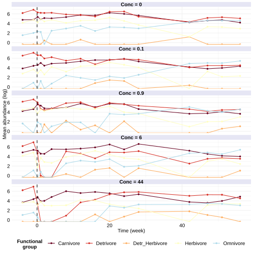

```{r knit-setup, include=FALSE, message=FALSE}
knitr::opts_chunk$set(
  collapse = TRUE,
  comment = "#>",
  echo = FALSE
  )
options(rmarkdown.html_vignette.check_title = FALSE) ## title and VignetteIndexEntry are slightly dfifferent and this avoids a warning message every time it's rendered
rmarkdown::html_document(df_print = knitr::kable)
```

```{r message=FALSE}
##library(eStar)
library(tidyverse)
library(viridis)
library(kableExtra)
##library(imputeTS)
library(MARSS)
library(cowplot)
library(ggsci)
source("custom_aesthetics.R")
```

In the `estar` package, estimations of maximal amplification, time to maximal amplification, intrinsic stochastic invariability, and asymptotic and initial resilience (definitions in Table 2 of main text) depend on measures of interaction strengths between species composing a community.
These measures are classically summarized in the _community matrix_ [sensu @novak_characterizing_2016, detailed in the Glossary in the main text].
In community models, this is equivalent to a time-discrete version [@downing_temporal_2020] of the Jacobian matrix composed of the partial derivatives of the dynamical equations describing each species population growth [@dominguez-garcia_unveiling_2019].
In real-world communities, they can be estimated with multivariate autoregressive state-space (MARSS) models.
In this vignette, we focus on explaining [how a MARSS model works](#intro-marss-model), the issues that may arise when empirical data is [limited](#limited-data), and how they can be used with the functions provided by the [`estar` package](#marss-in-estar).
To facilitate understanding, we illustrate the definition of a MARSS model in the context of this application to an [aquatic community](#aquatic-data)  and a [forest plant community](#forest-data) recovering from windthrows, bark beetle infestation, and logging.
For a more general and formal definition, refer to the [`MARSS` package documentation](https://nwfsc-timeseries.github.io/MARSS/).

# Overview of demonstration data

Similar to what we did for the univariate metrics, we illustrate the use of multivariate on a dataset compiled from an ecotoxicological study about the effects of insecticide use on a community of aquatic macroinvertebrates [@van_den_brink_effects_1996; @wijngaarden_effects_1996]. The insecticide chlorpyrifos, which negatively affects consumer, but not producer species [@radchuk_biodiversity_2016]. 
The community is composed of 128 species, classified into 5 functional groups: herbivores, detri-herbivores, carnivores, omnivores, and detrivores.

```{r fig.cap = "Organism mean count (log axis) of the five functional groups over the course of ecotoxicological experiment. The vertical line identifies the aplication of chloryfiros insecticide, and facets separates the different concentrations (nano g/L)."}

```

# MARSS models

## Introduction to MARSS models {#intro-marss-model}

A complete (MARSS) model that describes a state process ($\mathbf{X}$) assessed via an observation process ($\mathbf{Y}$) is defined as:
\begin{equation}
\begin{gathered}
\mathbf{x}_t = \mathbf{B}\mathbf{x}_{t-1}+\mathbf{u}+\mathbf{C}_{t}\mathbf{c}_{t}+\mathbf{w}_t \text{ where } \mathbf{w}_t \sim \ \text{MVN}(0,\mathbf{Q}) \\
\mathbf{y}_t = \mathbf{Z}\mathbf{x}_t+\mathbf{a}+\mathbf{D}_{t}\mathbf{d}_{t}+\mathbf{v}_t \text{ where } \mathbf{v}_t \sim \ \text{MVN}(0,\mathbf{R}) \\
\mathbf{x}_1 \sim\ \text{MVN}(\pi,\Lambda) \text{ or } \mathbf{x}_0 \sim\ \text{MVN}(\pi,\Lambda)
\end{gathered}
\end{equation}

where

- $\mathbf{X}$ is a $m \times T$ matrix, composed of the unknown abundance values of $m$ functional groups ($fg$, rows), over time $T$ ($t$, columns)

\begin{equation}
X=
\begin{bmatrix}
    x_{fg1, t1} & x_{fg1, t2} & ... & x_{fg1, tT}\\
  	x_{fg2, t1} & x_{fg2, t2} & ... & x_{fg2, tT}\\
	  ... & ... & ... & ...\\
	  x_{fgm, t1} & x_{fgm, t2} & ... & x_{fgm, tT}
\end{bmatrix}
\end{equation}

- $\mathbf{Y}$ is a $n \times T$ matrix, composed of $n$ observations (rows) over time $T$ ($t$, columns) 

\begin{equation}
Y=
\begin{bmatrix}
    y_{1, t1} & y_{1, t2} & ... & y_{1, tT}\\
	y_{2, t1} & y_{2, t2} & ... & y_{2, tT}\\
	... & ... & ... & ...\\
	y_{n, t1} & y_{n, t2} & ... & y_{n, tT}
\end{bmatrix}
\end{equation}

Note that:

- considering that the observations in $\mathbf{Y}$ refer to processes $\mathbf{X}$, $n \geq m$. Missing values can passed as `NA`.
- from $X$ and $Y$ alone, it is impossible to trace how observations refer to processes.
We will adress is in the description of $Y$.

The state process ($\mathbf{X}$) is described by:

- $\mathbf{x}_t$ is a $m \times 1$ vector of unkown abundances of the $m$ species at time $t$.
- $\mathbf{B}$ is a $m \times m$ matrix of states covariances. This is the interaction matrix of **interactions strengths** we want to estimate to calculate stability.
- $\mathbf{u}$ is a $m \times 1$ vector of states fixed values. For example, expected abundance values for each group.
- $\mathbf{c}_t$ is a $p \times 1$ vector of covariate values. For example, environmental conditions which are expected to affect abundances.
- $\mathbf{C}_t$ is a $m \times p$ matrix of coefficients ($\gamma$) of each of the $p$ covariates (enviromental conditions) effects on each of the $m$ states (abundances).
- $\mathbf{w}_t$ is a $m \times 1$ vector of errors expected to be involved in the state ($X$) we are assessing. These account, for the stochasticity of the system.

Thus, in matrix formulation:

\begin{equation}
\begin{bmatrix}
	x_{1}\\
    ... \\
	x_{m}
	\end{bmatrix}_t = 
\begin{bmatrix}
    \beta_{\mathrm{1}} & ... & \beta_{\mathrm{1,m}} \\
    ... & ... & ... \\
    \beta_{\mathrm{m,1}} & ... & \beta_{\mathrm{m}}
\end{bmatrix}
\begin{bmatrix}
	x_{1}\\
	... \\
	x_{m}
\end{bmatrix}_{t-1} 
+
\begin{bmatrix}
	u_{1}\\
	...\\
	u_{m}
\end{bmatrix} 
+ 
\begin{bmatrix}
    \gamma_{\mathrm{1, I}} \\
    ... \\
    \gamma_{\mathrm{m, I}}
\end{bmatrix}
\begin{bmatrix}
	I
\end{bmatrix}_t \\
+
\begin{bmatrix}
w_{1}\\
...\\
w_{m}
\end{bmatrix}_t \\
\end{equation}

The $w_{t}$ erros follow a multivariate normal distribution of mean 0, and covariance $\mathbf{Q}_t$ (a $m \times m$ matrix). 
\begin{equation}
\mathbf{w}_t \sim \,\text{MVN}
\begin{pmatrix}
0,
	\begin{bmatrix}
		\sigma_{\mathrm{1}} & \sigma_{\mathrm{1,2}} & .... & \sigma_{\mathrm{1,m}} \\
		... & ... & ... \\
		\sigma_{\mathrm{m,1}} & \sigma_{\mathrm{m,2}} & ... & \sigma_{\mathrm{m}} \\ 
		\end{bmatrix}
\end{pmatrix}\\
\end{equation}

where ($\sigma$) refer to processes own variances (diagonal) or covariances among processes.

The model initial conditions can be specified at $t=0$ ($x_0$) or $t=1$ ($x_1$).

\begin{equation}
\begin{bmatrix}
	x_{fg1}\\
    ...\\
	x_{fgm}
\end{bmatrix}_0 
= 
\begin{bmatrix}
	\mu_1\\
	...\\
	\mu_m
\end{bmatrix}_t
\end{equation}

The observation process ($\mathbf{Y}$) is described by:

- $\mathbf{y}_t$ is a $m \times 1$ with the number of $n$ observations taken at time $t$.
- $\mathbf{Z}_t$ is a $\mathbf{n} \times m$ matrix which describes the relationship between hidden states $\mathbf{x}$ (real abundances of functional groups) and the observations $\mathbf{y}$ measured (samples).
- $\mathbf{a}$ is a $n \times 1$ vector of fixed values.
- $\mathbf{d}_t$ s a $q \times 1$ vector of covariate values affecting the observation process.
- $\mathbf{D}_t$ is a $n \times q$ matrix of coefficients of each of the $q$ covariates on each of the $n$ observations.
- $\mathbf{v}_t$ is a $n \times 1$ vector of observation errors. They follow a multivariate normal distribution of mean 0, and covariance $\mathbf{R}_t$ (a $n \times n$ matrix) .

In matrix formulation:
\begin{equation}
 \left[ \begin{array}{c}
    y_{1} \\
    ... \\
    y_{n} 
\end{array} \right]_t = 
Z
\begin{bmatrix}
x_1\\
...\\
x_m
\end{bmatrix}_t +  
    \left[ \begin{array}{c}
    a_{obs1} \\
    ... \\
    a_{obs3} \end{array} \right] +
\begin{bmatrix}
    \delta_{\mathrm{obs1, E}} \\
    ... \\
    \delta_{\mathrm{obsn, E}}
\end{bmatrix}
\begin{bmatrix}
E
\end{bmatrix}_t \\ +
    \left[ \begin{array}{c}
    v_{obs1} \\
    ... \\
    v_{obsn} \end{array} \right]_t
\end{equation}

\begin{equation}
\mathbf{v}_t \sim \,\text{MVN}
\begin{pmatrix}0,
	\begin{bmatrix}
		\sigma_{\mathrm{1}} & ... & \sigma_{\mathrm{1,n}} \\
		... & ... & .... \\
		\sigma_{\mathrm{n,1}} & ... & \sigma_{\mathrm{n}} \\ 
	\end{bmatrix}
\end{pmatrix}\\
\end{equation}

Parameters $\mathbf{B}$, $\mathbf{u}$, $\mathbf{C}$, $\mathbf{Q}$, $\mathbf{Z}$, $\mathbf{a}$, $\mathbf{D}$, and $\mathbf{R}$ can be composed of both estimated and fixed values, depending on the assumptions around the system. 
The terms $\mathbf{c}_t$ and $\mathbf{d}_t$ must be given as an input, without any missing values.

## MARSS in estar {#marss-in-estar}

When calculating maximal amplification, time to maximal amplification, intrinsic stochastic invariability, and asymptotic and initial resilience, the user can either provide the required community matrix ($B$) or have it estimated from a variety of predefined assumptions about the modelled system. In this section we detail what are these assumptions and show how they might affect the estimation of ($B$) by applying them to the same study case. None of the parameters detailed here have default values in functions that calculate the metrics above, to avoid the indiscriminate use, and thus force the user to take into consideration the implication of the assumptions chosen.

We start from the minimal case of one single observation per state process and other simplifying assumptions, and complexify it step-wise.

## Minimal case

In our minimal case, we consider that
- Each observation corresponds to one state process ($y_i = x_i$), thus `Z = "identity"`. In this case, it corresponds to a $5 \times 5$ identity matrix, since $n = m$:
```{r}
Z_I5 <- matrix(list(0), 5, 5)
diag(Z_I5) <- 1
```

- All functional groups have the same state processes variance*: $w_t = \sigma$, thus `Q = "diagonal and equal"`, which we equates to 
\begin{equation}
\begin{bmatrix}
		\sigma & 0 & 0 & 0 & 0 \\
		0 & \sigma & 0 & 0 & 0 \\
		0 & 0 & \sigma & 0 & 0 \\
		0 & 0 & 0 & \sigma & 0 \\
		0 & 0 & 0 & 0 & \sigma\\
		\end{bmatrix}
\end{equation}		
- Observational error is th same for all functional groups: $v_t = v$, thus `R = 0`
- Constant covariates*: $C_{t} = C$ and $c_{t} = c = 0$
- U = A = 0
- $X_0 = X_{t=1}$, which is passed to the `MARSS()` as the argument `tinitx = 1`

Note that processes error and constant covariates are required for @downing_temporal_2020's estimation of asymptotic resilience

Such model is formalized as:

\begin{equation}
X = \mathbf{B}.X_{t-1} + C.0 + 0 + 0 \\

Y =  Z.X_t + 0 + D_t.0 + v \\
\end{equation}

Thus, our [aquatic commmunity data](aquatic-data) must be split into matrices $Y_{control}, Y_{0.1}, Y_{0.9}, Y_6, Y_{44}$, each containing the time-series of organisms counts under one treatment. Since we have replicates but we are modelling one observation as correponding to one state processes, we use the summarized data, we :

```{r eval=FALSE}
## calculate z-scores
aquacommz_allscen.ldf <- aquacomm_fgps %>%
    dplyr::filter(time >= 1 , time <= 28) %>%
    ungroup() %>%
    dplyr::mutate_at(vars(herb, detr_herb, carn, omni, detr), 
                     ~MARSS::zscore(.)) %>%
    dplyr::mutate(across(c(herb, detr_herb, carn, omni, detr),
                         ~dplyr::na_if(., 0))) %>%
    tidyr::pivot_longer(cols = c(herb, detr_herb, carn, omni, detr),
                        names_to = "fgp",
                        values_to = "abund")

## summarize abunds over replicates
aquacommz_allscen.summldf <- aquacommz_allscen.ldf %>%
    dplyr::group_by(time, treat, fgp) %>%
    dplyr::summarize(abund_mu = mean (abund),
                     abund_sd = sd(abund)) %>%
    dplyr::ungroup()

## convert into time-series matrix
(aquacommz_allscen.summmxls <- aquacommz_allscen.summldf %>%
    dplyr::select(time, treat, fgp, abund_mu) %>%
    split(.$treat) %>%
    map(~ dplyr::select(., time, fgp, abund_mu) %>%
        unique() %>%
        tidyr::pivot_wider(id_cols = fgp,
                           names_from = time, values_from = "abund_mu", 
                           names_prefix = "time ") %>%
        tibble::column_to_rownames(var = "fgp") %>%
        as.matrix()))
```

As we want to estimate all interaction strengths, we set `B = "unconstrained"`.
```{r eval=FALSE}
aquacommz_allscen.marssls <- aquacommz_allscen.summmxls %>%
    map(~ MARSS(.,
                list(B = "unconstrained",
                     U = "zero", A = "zero",
                     Z = "identity", ## Z_I5 could also have been provided here 
                     Q = "diagonal and equal", 
                     R = R_05,
                     tinitx = 1),
                method = "BFGS"))
```

We provide the function `eStar::extractB` which extracts $B$ in matrix form and names the interacting groups
```{r}
(aquacomm.Bls <- aquacommz_allscen.marssls %>%
  map(~eStar::extractB(., 
                states_names = c("Herbivores", "DetHerbivores", "Carnivores", "Omnivores", "Detrivores"))))
```

Finally, having estimated $B$ we can calculate all the multivariate metrics:

* Initial resilience
```{r}
aquacomm.Bls %>%
  map(eStar::init_resil)
```

* Asymptotic resilience
```{r}
aquacomm.Bls %>%
  map(eStar::asympt_resil)
```

#TODO
- estimate B with Q calculated from processes variances.
- estimate B for each replicate and then average them.
<!-- ## Multiple obsevation per state process  -->
<!-- In this case, $y = n \times x$. -->
<!-- Even if some state processes lack one or more observations, these can be given as `NA` values in $Y$. -->
<!-- We provide the function ` build_Zreps(n_reps, m_grps)`: -->
<!-- ```{r} -->

<!-- ``` -->

<!-- ## Processes have the same variance and no covariance -->
<!-- In this case, $Q = \text{"diagonal and unequal"}$ which equates to  -->
<!-- \begin{equation} -->
<!-- Q =  -->
<!-- \begin{bmatrix}  -->
<!--    \sigma & 0 & 0 \\ -->
<!--     0 & \sigma & 0 \\ -->
<!--     0 & 0 & \sigma -->
<!-- \end{bmatrix} -->
<!-- \end{equation}. -->

<!-- ## Each process has its own variance and no covariance. -->

<!-- In this case, $Q = \text{"diagonal and unequal"}$. -->

<!-- \begin{equation} -->
<!-- Q =  -->
<!-- \begin{bmatrix}  -->
<!--     \sigma_{1, 1} & 0 & 0 \\ -->
<!--     0 & \sigma_{i, i} & 0 \\ -->
<!--     0 & 0 & \sigma_{m, m} -->
<!-- \end{bmatrix} -->
<!-- \end{equation}. -->

# Limited data {#limited-data}

# References

<!-- # Process and observations errors -->

<!-- autoregressive and non-independent error can be included in B1 -->


<!-- ## perfect scenario: -->

<!-- ```{r eval=FALSE} -->
<!-- load("../../data_prep/windblow_barkbeetle/windthrow_longts.RData") -->
<!-- ``` -->

<!-- ```{r eval=FALSE} -->
<!-- pllongts_raw.forestlist[[1]] %>%  -->
<!--   t %>% -->
<!--   cbind("t" = as.integer(rownames(.)),.) %>% -->
<!--   as_tibble()  -->
<!-- ``` -->

<!-- ```{r eval=FALSE} -->
<!-- plot_raw <- function(df){ -->
<!--   df %>% -->
<!--   ggplot(aes(x = time, y = cover, colour = gp, group = gp)) + -->
<!--   geom_line() + -->
<!--   geom_point() + -->
<!--   facet_wrap(~rep) + -->
<!--   scale_colour_manual(values = viridis(n = 5)) + -->
<!--   labs(x = "Time", y = "Cover (%)", colour = "Func.\ngroup") + -->
<!--   theme_minimal() -->
<!-- } -->

<!-- pllongts_raw.forestdf %>% -->
<!--   ## convert time to absolute, instead of time since disturbance -->
<!--   dplyr::mutate(time = d_time + abs(min(d_time))) %>% -->
<!--   tidyr::pivot_longer(col = gp1:gp5, -->
<!--                       names_to = "gp", -->
<!--                       values_to = "cover") %>% -->
<!--   plot_raw() -->
<!-- ``` -->

<!-- ```{r eval=FALSE} -->
<!-- pllongts_raw.barkdf %>% -->
<!--   dplyr::rename(time = d_time) %>% -->
<!--   tidyr::pivot_longer(col = gp1:gp5, -->
<!--                       names_to = "gp", -->
<!--                       values_to = "cover") %>% -->
<!--   plot_raw() + -->
<!--   geom_vline(xintercept = 0, color = "#ff0066") -->
<!-- ``` -->

<!-- MARSS takes y  s a  matrix ts object -->

