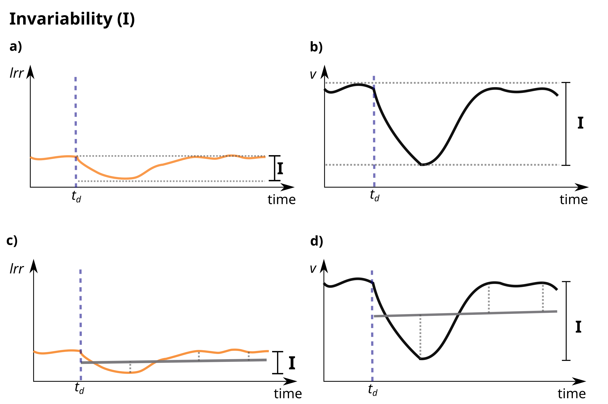
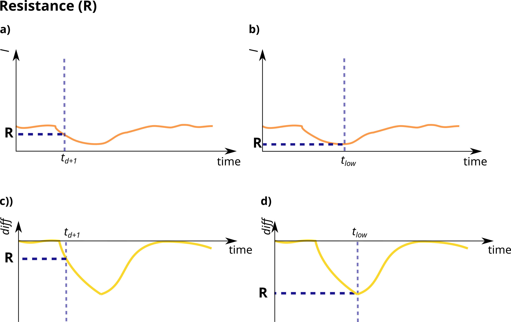
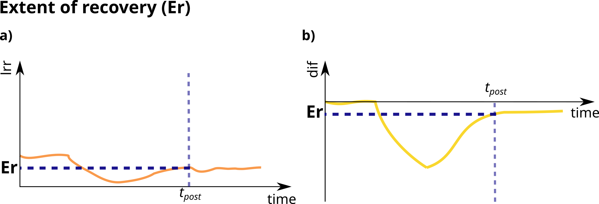
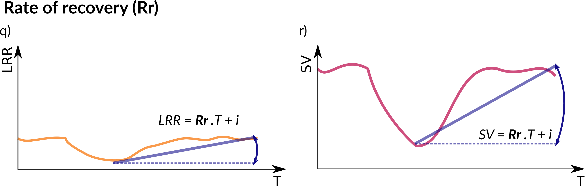
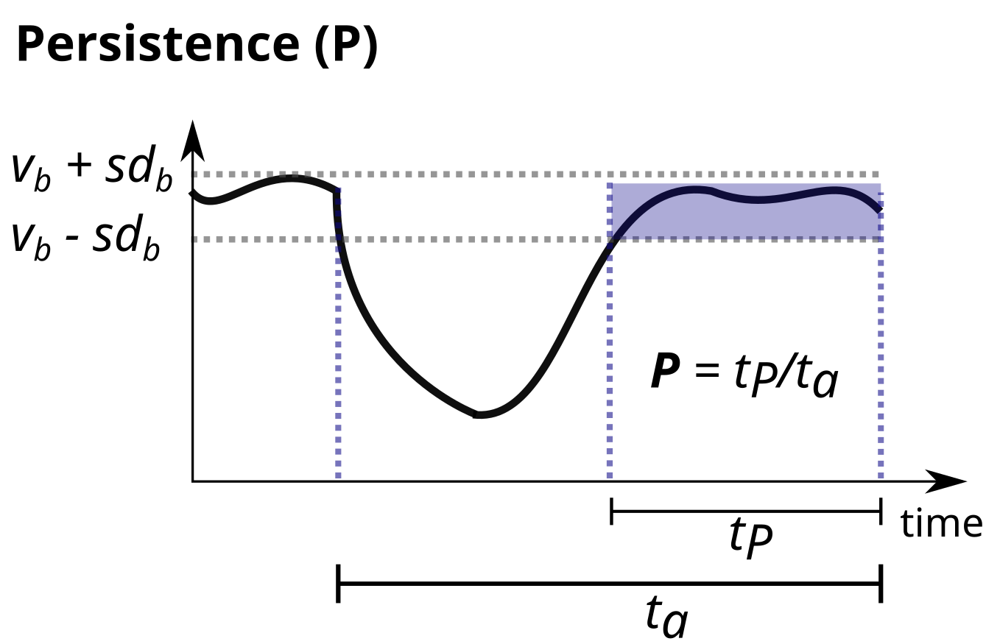

```{r, echo=FALSE}
knitr::opts_chunk$set(collapse = TRUE, comment = "#>")
options(rmarkdown.html_vignette.check_title = FALSE)
set.seed(123)
```

```{r, setup, include=FALSE}
library(estar)
library(tidyr)
library(dplyr)
library(ggplot2)
library(cowplot)
library(viridis)
library(forcats)
library(kableExtra)
source("custom_aesthetics.R")

label_intensity <- function(intensity, mu) {
  paste0("Conc = ", intensity, " micro g/L")
}
```

<!-- colors : -->

<!-- Deep blue "#0D0887FF"  -->

<!-- Purple "#7E03A8FF"  -->

<!-- Dark pink "#CC4678FF"  -->

<!-- Orange "#F89441FF"  -->

<!-- Yellow "#F0F921FF" -->

# Overview of demonstration data

We illustrate the use of `estar` functions on a dataset from an
ecotoxicological study about the effects of the chlorpyrifos insecticide
on a community of aquatic macroinvertebrates [@van_den_brink_effects_1996; @wijngaarden_effects_1996]. The insecticide negatively affects freshwater
macroinvertebrates, and, to a lesser degree, zooplankton species. This insecticide was applied at four
different concentrations (0.1, 0.9, 6, and 44 microg/ L), with two
replicates per concentration level. Additionally, four replicates were
used as control, undisturbed systems ('baseline' in `estar`
terminology). In response to a pulse disturbance (Glossary in main
text), @van_den_brink_effects_1996 reports decreased and
destabilized community diversity, but no effects on gross primary
production nor respiration. The community is composed of 128 species,
classified into 5 functional groups: herbivores, detriti-herbivores,
carnivores, omnivores, and detritivores.

```{r echo = FALSE, message = FALSE,  fig.height = 6, fig.width = 8, fig.cap = "Organism mean count (log axis) of the five functional groups over the course of ecotoxicological experiment. The vertical dashed line identifies the time when the insecticide was applied (at week 0), and facets represent the different concentrations (micro g/L)."}
(
  aquacomm_resps.logplot <- aquacomm_fgps |>
    tidyr::pivot_longer(
      cols = c(herb, detr_herb, carn, omni, detr),
      names_to = "gp",
      values_to = "abund"
    ) |>
    ## summarize to plot
    dplyr::group_by(time, treat, gp) |>
    dplyr::summarize(abund_logmean = log(mean(abund))) |>
    dplyr::ungroup() |>
    dplyr::mutate(
      gp = forcats::fct_recode(
        factor(gp),
        Herbivore = "herb",
        Detr_Herbivore = "detr_herb",
        Carnivore = "carn",
        Omnivore = "omni",
        Detritivore = "detr"
      )
    ) |>
    ggplot(aes(
      x = time,
      y = abund_logmean,
      group = gp,
      colour = gp
    )) +
    geom_line() +
    geom_point(size = 1) +
    geom_vline(
      aes(xintercept = 0),
      linetype = 2,
      colour = "black"
    ) +
    scale_colour_manual(values = intensity_colors[seq(from = 1,
                                                      by = 2,
                                                      length.out = 5)]) +
    facet_wrap(
      ~ treat,
      nrow = 5,
      labeller = labeller(treat = label_intensity)
    ) +
    labs(x = "Time (week)", y = "Mean abundance (log)", colour = "Functional\ngroup") +
    theme_estar()
)
```

```{r echo=FALSE, message = FALSE, fig.height = 6, fig.width = 8, fig.cap="Organism count (mean +- sd in grey) of the five functional groups over the course of ecotoxicological experiment. The vertical line identifies the time when the insecticide was applied (at week 0), and facets represent the different concentrations (micro g/L)."}
(
  aquacomm_resps.rawplot <- aquacomm_fgps |>
    tidyr::pivot_longer(
      cols = c(herb, detr_herb, carn, omni, detr),
      names_to = "gp",
      values_to = "abund"
    ) |>
    ## summarize to plot
    dplyr::group_by(time, treat, gp) |>
    dplyr::summarize(abund.mean = mean(abund), abund.sd = sd(abund)) |>
    dplyr::ungroup() |>
    dplyr::mutate(
      gp = forcats::fct_recode(
        factor(gp),
        Herbivore = "herb",
        Detr_Herbivore = "detr_herb",
        Carnivore = "carn",
        Omnivore = "omni",
        Detritivore = "detr"
      )
    ) |>
    ggplot(aes(
      x = time,
      y = abund.mean,
      group = gp,
      colour = gp
    )) +
    geom_ribbon(
      aes(ymin = abund.mean - abund.sd, ymax = abund.mean + abund.sd),
      col = "gainsboro",
      fill = "gainsboro"
    ) +
    geom_line() +
    geom_point(size = 1) +
    geom_vline(
      aes(xintercept = 0),
      linetype = 2,
      colour = "black"
    ) +
    scale_colour_manual(values = intensity_colors[seq(from = 1,
                                                      by = 2,
                                                      length.out = 5)]) +
    facet_wrap(
      ~ treat,
      nrow = 5,
      labeller = labeller(treat = label_intensity)
    ) +
    labs(x = "Time (week)", y = "Mean abundance", colour = "Functional\ngroup") +
    theme_estar()
)
```

# Main functions

Examples of each function applied to the example dataset. For the
functions that require a user-defined time step when were the system has
recovered, we use week 28, when all groups seem to have stabilized their
growth curve (Fig.1).

## Invariability

Invariability calculated as the inverse of standard deviation of
residuals of the linear model that predicts the log response ratio of
the state variable in the disturbed and baseline systems by time. The
baseline system in our example dataset is reflected by control ditches,
to which no pesticide was applied. The time frame is defined by `tb_i`
and specified in the data frame `d_data` (`aquacomm_resps`, Fig. 2-a).

```{r}
invariability(
  mode = "lm_res",
  response = "lrr",
  metric_tf = c(1, max(aquacomm_resps$time)),
  vd_i = "statvar_db",
  td_i = "time",
  d_data = aquacomm_resps,
  vb_i = "statvar_bl",
  tb_i = "time",
  b_data = aquacomm_resps
)
```

Invariability calculated as the inverse of standard deviation of
residuals of the linear model fitted to predict the state variable in
the disturbed system by time (Fig. 2-b).

```{r}
invariability(
  mode = "lm_res",
  metric_tf = c(1, max(aquacomm_resps$time)),
  response = "v",
  vd_i = "statvar_db",
  td_i = "time",
  d_data = aquacomm_resps,
  vb_i = "statvar_bl",
  tb_i = "time",
  b_data = aquacomm_resps
)
```

Invariability calculated as the inverse of the coefficient of variation
of the log response ratio of the state variable in the disturbed and
baseline systems (Fig. 2-c).

```{r}
invariability(
  response = "lrr",
  mode = "cv",
  metric_tf = c(1, max(aquacomm_resps$time)),
  vd_i = "statvar_db",
  td_i = "time",
  b_data = aquacomm_resps,
  vb_i = "statvar_bl",
  tb_i = "time",
  d_data = aquacomm_resps
)
```

Invariability calculated as the inverse of the coefficient of variation
of a state variable in the disturbed system (Fig. 2-d).

```{r}
invariability(
  response = "v",
  mode = "cv",
  metric_tf = c(1, max(aquacomm_resps$time)),
  vd_i = "statvar_db",
  td_i = "time",
  d_data = aquacomm_resps,
  vb_i = "statvar_bl",
  tb_i = "time",
  b_data = aquacomm_resps
)
```

```{r invar_schem, echo=FALSE, fig.height = 4, fig.cap="Figure 2: Schematic representation of the possible metrics of invariability available in the estar package. 'lrr' refers to the log response ratio of the state variable in the disturbed system compared to the baseline time-series, and 'v' to 'state variable' in the disturbed system. a) and b) demonstrate calculation of invariability based on the standard deviation of the residuals of the fitted linear model, whereby the linear model fit is shown by a blue solid line. c) and d) demonstrate calculation of invariability based on the coefficient of variation", out.width = '100%'}

```

## Resistance

Resistance calculated in relation to a baseline time series
(`b = "input"`), as the log response ratio (`res_mode = "lrr"`) of the
state variable in the disturbed and baseline systems at the first time
step following disturbance (`res_time = "defined"`, `res_t = 1`, Fig.
3-a).

```{r}
resistance(
  b = "input",
  res_mode = "lrr",
  res_time = "defined",
  res_t = 1,
  vd_i = "statvar_db",
  td_i = "time",
  d_data = aquacomm_resps,
  vb_i = "statvar_bl",
  tb_i = "time",
  b_data = aquacomm_resps
)
```

Resistance calculated in relation to a baseline time series
(`b = "input"`), as the highest (`res_time = "max"`) log response ratio
(`res_mode = "lrr"`) of the state variable in the disturbed and baseline
systems during a given time frame (`res_tf = c(1, 20)`, Fig. 3-b).

```{r}
resistance(
  b = "input",
  res_mode = "lrr",
  res_time = "max",
  res_tf = c(1, 20),
  vd_i = "statvar_db",
  td_i = "time",
  d_data = aquacomm_resps,
  vb_i = "statvar_bl",
  tb_i = "time",
  b_data = aquacomm_resps
)
```

Resistance calculated in relation to a baseline time series
(`b = "input"`), as the difference (`res_mode = "diff"`) at the first
time step following disturbance (`res_time = "defined"`, `res_t = 1`,
Fig. 3-c).

```{r}
resistance(
  b = "input",
  res_mode = "diff",
  res_time = "defined",
  res_t = 1,
  vd_i = "statvar_db",
  td_i = "time",
  d_data = aquacomm_resps,
  vb_i = "statvar_bl",
  tb_i = "time",
  b_data = aquacomm_resps
)
```

Resistance calculated in relation to a baseline time series
(`b = "input"`), as the highest (`res_time = "max"`) absolute difference
(`res_mode = "diff"`) during a given time frame (`res_tf = c(11, 50)`,
Fig. 3-d).

```{r}
resistance(
  b = "input",
  res_mode = "diff",
  res_time = "max",
  res_tf = c(1, 20),
  vd_i = "statvar_db",
  td_i = "time",
  d_data = aquacomm_resps,
  vb_i = "statvar_bl",
  tb_i = "time",
  b_data = aquacomm_resps
)
```

Resistance calculated in relation to a pre-disturbance baseline
(`b = "d"`), composed of the state variable values in the three time
steps before disturbance (`b_tf = c(-4, -0.14)`), as the highest
(`res_time = "max"`) absolute difference (`res_mode = "diff"`) during a
given time frame (`res_tf = c(11, 50)`, Fig. 3-d).

```{r}
resistance(
  b = "d",
  b_tf = c(-4, 0.14),
  res_time = "max",
  res_mode = "diff",
  res_tf = c(1, 20),
  vd_i = "statvar_bl",
  td_i = "time",
  d_data = aquacomm_resps
)
```

Resistance calculated in relation to a pre-disturbance baseline
(`b = "d"`), composed of the state variable values in the three time
steps before disturbance (`b_tf = c(-4, -0.14)`), as the highest
(`res_time = "defined"`) absolute log-ratio (`res_mode = "lrr"`) at a
precise time step (`res_t = 1)`, Fig. 3-d).

```{r}
resistance(
  b = "d",
  b_tf = c(-4, 0.14),
  res_mode = "lrr",
  res_time = "defined",
  res_t = 1,
  vd_i = "statvar_db",
  td_i = "time",
  d_data = aquacomm_resps
)
```

```{r resistance_schem, fig.height = 4, echo=FALSE, fig.cap="Figure 3: Schematic representation of the possible metrics of resistance available in the estar package. 'lrr' and 'diff' refer, respectively, to the log response ratio and to the difference between the state variable in the disturbed system in relation to the baseline value(s), 'v' to 'state variable', 'td+1', to the first time step after disturbance, and 'tlow', to the time step of the highest response in relation to the baseline.", out.width = '100%'}

```

## Extent of recovery

Extent of recovery calculated as the log response ratio
(`response = "lrr"`) of the state variable in the disturbed and baseline
systems (`b = "input"`), at a user-defined time step (`t_rec = 28`, Fig.
4-a).

```{r}
recovery_extent(
  response = "lrr",
  b = "input",
  t_rec = 28,
  vd_i = "statvar_db",
  td_i = "time",
  d_data = aquacomm_resps,
  vb_i = "statvar_bl",
  tb_i = "time",
  b_data = aquacomm_resps
) 
```

Extent of recovery calculated as the difference (`response = "lrr"`)
between the state variables in a disturbed time-series and the baseline
(`b = "input"`), at the predefined time step (`t_rec = 28`, Fig. 4-b).

```{r}
recovery_extent(
  response = "diff",
  b = "input",
  t_rec = 28,
  vd_i = "statvar_db",
  td_i = "time",
  d_data = aquacomm_resps,
  vb_i = "statvar_bl",
  tb_i = "time",
  b_data = aquacomm_resps
)
```

Extent of recovery calculated as the log response ratio
(`response = "lrr"`) of the state variable in the disturbed time-series
in relation to the state variable pre-disturbance (`b = "d"`),
summarized by the mean value (`summ_mode = "mean"` - default, over a
period `b_tf = c(5, 10)`). The extent of recovery is calculated at the
point we understand all groups have stabilized (`t_rec = 28`).

```{r}
recovery_extent(
  response = "lrr",
  b = "d",
  summ_mode = "mean",
  b_tf = c(5, 10),
  t_rec = 28,
  vd_i = "statvar_db",
  td_i = "time",
  d_data = aquacomm_resps
)
```

```{r echo=FALSE, fig.height = 4, fig.cap="Figure 4: Schematic representation of the possible metrics of extent of recovery available in the estar package. 'lrr' refers to the log response ratio of the state variable in the disturbed system compared to the baseline time-series, 'diff' to the difference between them, and 'tpost', to a post-disturbance time step, specified by the user.", out.width = '100%'}

```

## Rate of recovery

Rate of recovery calculated as the slope of the linear model which
predicts the log response ratio of the state variable in the disturbed
system compared to the baseline (`b = "input`) by time (over a time
frame (`metric_tf = c(1, 28)`, Fig. 5-a).

```{r}
recovery_rate(
  b = "input",
  metric_tf = c(1, 28),
  vd_i = "statvar_db",
  td_i = "time",
  d_data = aquacomm_resps,
  vb_i = "statvar_bl",
  tb_i = "time",
  b_data = aquacomm_resps
)
```

Rate of recovery calculated as the slope of the linear model which
predicts the values of the state variable in the disturbed system
(`b = "d"`) by time (over a time frame (`metric_tf = c(1, 28)`, Fig.
5-b).

```{r}
recovery_rate(
  b = "d",
  metric_tf = c(1, 28),
  vd_i = "statvar_db",
  td_i = "time",
  d_data = aquacomm_resps,
  vb_i = "statvar_bl",
  tb_i = "time",
  b_data = aquacomm_resps
)
```

```{r echo=FALSE, fig.height = 4, fig.cap="Figure 5: Schematic representation of the possible metrics of rate of recovery available in the estar package. 'lrr' refers to the log response ratio of the state variable in the disturbed system compared to the baseline time-series, 'v' to 'state variable'. The blue solid line identifies the linear model fitted to predict the response from time (along with its equation) and the double-headed arrow identifies the slope, which is the measure of rate of recovery", out.width = '100%'}

```

## Persistence

Proportion of time over which the system persisted as defined by it
being within 1 standard deviation from the mean of the state variable
values in an independent baseline (`b = "input"`) during the same time
period for which persistence is measured
(`metric_tf = c(28, max(aquacomm_resps$time))`, Fig. 6).

```{r}
persistence(
  b = "input",
  metric_tf = c(28, max(aquacomm_resps$time)),
  vd_i = "statvar_db",
  td_i = "time",
  d_data = aquacomm_resps,
  vb_i = "statvar_bl",
  tb_i = "time",
  b_data = aquacomm_resps
)
```

Proportion of time over which the system persisted as defined by it
being within 1 standard deviation from the mean of the state variable
values during a pre-disturbance (`b = "d"`) time period
(`b_tf = c(-4, 0.14)`). Persistence is measured for the post-disturbance
time period (`metric_tf = c(1, 60)`, Fig. 6).

```{r}
persistence(
  b = "d",
  b_tf = c(-4, 0.14),
  metric_tf = c(28, max(aquacomm_resps$time)),
  vd_i = "statvar_db",
  td_i = "time",
  d_data = aquacomm_resps
)
```

```{r echo=FALSE, out.width = '50%',vfig.cap="Figure 6: Schematic representation of the possible metrics of persistence available in the estar package. 'v' refers to 'state variable', 'lim_u' and 'lim_l' are the upper and lower limits defined as +1 and -1 standard deviation of the baseline state variable around the mean of the baseline state variable. 'ta' is the period for which persistence is calculated for, and 'tP', the period during which the state variable remained inside the limits."}


```

# Performance

We conducted the benchmark analysis of the execution time of the different forms of calculating the temporal metrics. The number attached to the function name in "Function calls" identifies the order in which the function call appears in the vignette. The code used for the analysis is available in `performance_analysis.R`.

While the time to run the calls can differ significantly from each other, the execution time did not exceed 0.01 seconds for our example.

```{r echo=FALSE}
load("univariate_performance.rda")
```

## Invariability

```{r}
df_list$inv_benchmark %>%
  dplyr::select(-neval) %>% 
  kableExtra::kbl() %>%
  kable_styling(bootstrap_options = c("striped", "hover", "condensed", "responsive"))
```

{width=100%}

## Resistance

```{r}
df_list$resis_benchmark %>%
  dplyr::select(-neval) %>% 
  kableExtra::kbl() %>%
  kable_styling(bootstrap_options = c("striped", "hover", "condensed", "responsive"))
```

{width=100%}

## Recovery rate

```{r}
df_list$rate_benchmark %>%
  dplyr::select(-neval) %>% 
  kableExtra::kbl() %>%
  kable_styling(bootstrap_options = c("striped", "hover", "condensed", "responsive"))
```

{width=100%}

## Recovery extent

```{r}
df_list$extent %>%
  dplyr::select(-neval) %>% 
  kableExtra::kbl() %>%
  kable_styling(bootstrap_options = c("striped", "hover", "condensed", "responsive"))
```

{width=100%}

## Persistence

```{r}
df_list$persist_benchmark %>%
  dplyr::select(-neval) %>% 
  kableExtra::kbl() %>%
  kable_styling(bootstrap_options = c("striped", "hover", "condensed", "responsive"))
```

{width=100%}

------------------------------------------------------------------------

# References
